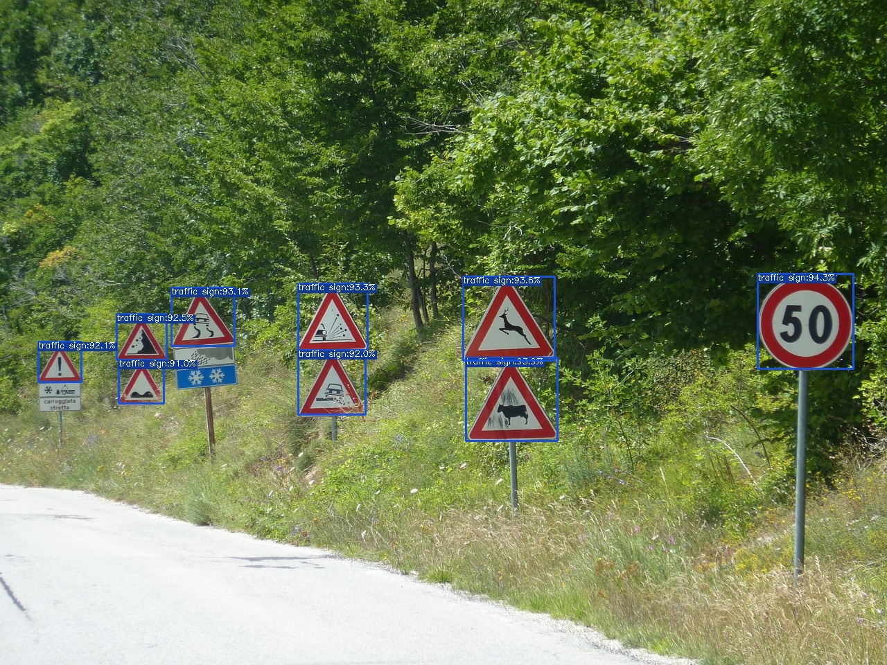

# TSDR App

Android App for detecting and classifying traffic signs as part of my Bachelor's thesis in Software and Information Engineering at TU Wien.

# Quickstart

## 1. Clone repository

Clone this project locally.

## 2. Python environment

Create a new python environment for this project and activate it.

## 3. Install yolox

The object detection algorithm used in this project is yoloX. A customized fork of the original yoloX github project is included in this project as a submodule.

YoloX needs to be installed in the active python environment in order for the detection to work. Navigate to the submodule folder and follow the installation instructions given there in the README.

## 4. Install backend

The backend is given as a django project. Navigate into the backend folder and follow the installation instructions given there in the README.

## 5. Android app (TBD) 