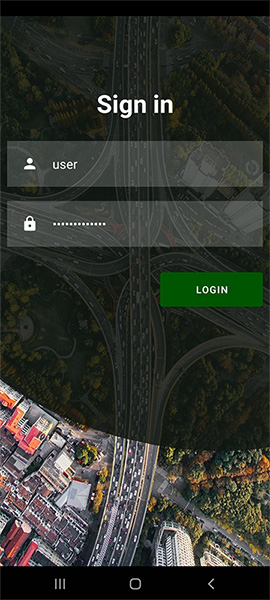
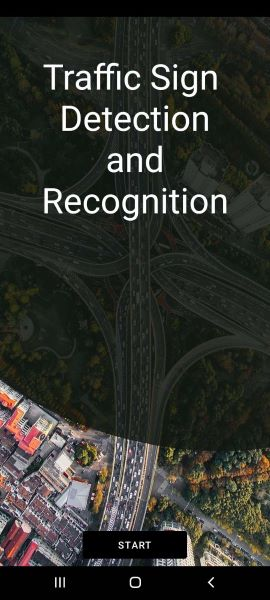
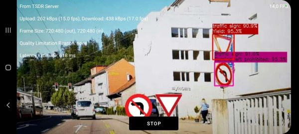

# Frontend app for android

This project represents the frontend for the TSDR app. It allows using a camera of an android device to detect traffic signs.

All devices running android version 5.0 (API level 21) to version 12.0 (API level 31) are supported. 

## Installation

Open the project in android studio and use the SDK manager to download android SDK 12.0 (API Level 31).

Create the file `app/src/main/res/raw/backend_host.txt`. In its first line, provide the host name and port number of the backend server. I.e. `localhost:8080` (this is also the default host assumed when no host is given within the file).

## Quickstart

Run or build the project on an android device that has a camera installed (it will not work on devices that have no camera). The app can also be run on emulators, however testing it there is harder due to emulators having limited or no camera support.

When starting the app, a login screen appears. Supply credentials of users that were manually added to the backend database (see backend documentation for more information on this).

After logging in, the app should show a video stream highlighting recognized traffic signs. Keep in mind that the backend needs to run for this to work. 